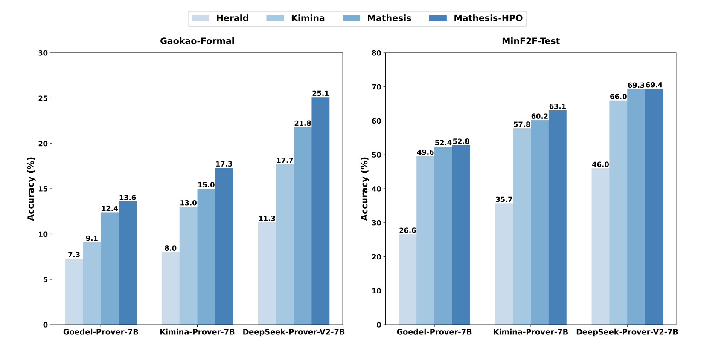
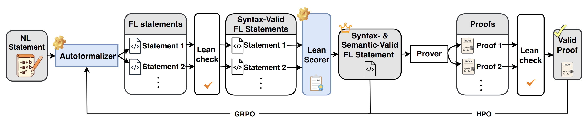
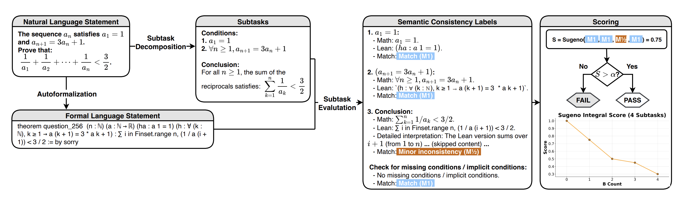

# Mathesis: Towards Formal Theorem Proving from Natural Languages

Mathesis is a pipeline for studying formal theorem proving from natural language: translating informal problem statements into Lean 4 and then generating machine-verified proofs.

Most LLM-based theorem provers still assume expert-written formal statements, which limits use on real problems stated in natural language. Mathesis targets autoformalization—turning informal mathematics into formal statements—with:

- **Mathesis-Autoformalizer**, the first autoformalizer trained with **online reinforcement learning** (Group Relative Policy Optimization, GRPO). Rewards combine **Lean syntactic validity**, **semantic correctness**, and **prover feedback**; a second stage uses **Direct Preference Optimization (DPO)** to prefer formalizations that lead to Lean-verified proofs. We call this two-stage procedure **Hierarchical Preference Optimization (HPO)**.
- **LeanScorer**, an evaluation framework that combines **LLM-based analysis** with the **Sugeno fuzzy integral** for fine-grained semantic assessment of formalizations.
- **Gaokao-Formal**, a benchmark of **495** challenging proof problems derived from China’s college entrance exam (**Gaokao**), for testing autoformalization and end-to-end proving in realistic settings.

**Results (from the paper).** The autoformalizer improves pass rates by **45%** on Gaokao-Formal and **6%** on MiniF2F vs. strong baselines; paired with provers, it consistently raises proving accuracy (e.g. **42%** gain for DeepSeek-Prover-V2 on Gaokao-Formal). The paper also reports large relative gains when combining the autoformalizer with existing provers on Gaokao-Formal and MiniF2F.

<div align="center" style="line-height: 1;">
  <a href="https://huggingface.co/huawei-ai4math"><b>HuggingFace</b></a>
</div>

<p align="center">
    <br>
    
    <br>
</p>

## News

- **2026:** Accepted and published as a conference paper at ICLR 2026.
- **2025/06/10:** [arXiv preprint](https://arxiv.org/abs/2506.07047) (arXiv:2506.07047).

<p align="center">
    <br>
    
    <br>
</p>

## Mathesis-Autoformalizer

Translates natural-language math into **Lean 4** statements. Unlike training only on static parallel data, Mathesis-Autoformalizer uses **RL** with **composite rewards** (Lean compile / type-check up to `sorry`, semantic alignment, and downstream proof success via **HPO**), aiming for statements that are both faithful and usable by provers.

## LeanScorer

Produces a **continuous** correctness-style score from **0 to 1** for nuanced comparison beyond binary pass/fail, so you can tune thresholds for precision/recall. See `leanscorer.py` in this repository for the implementation used in the project.

<p align="center">
    <br>
    
    <br>
</p>

## Citation

If you use the data or code, please cite the **ICLR 2026** proceedings version when available, and the arXiv preprint if helpful:

```bibtex
@misc{xuejun2025mathesisformaltheoremproving,
      title={Mathesis: Towards Formal Theorem Proving from Natural Languages}, 
      author={Yu Xuejun and Jianyuan Zhong and Zijin Feng and Pengyi Zhai and Roozbeh Yousefzadeh and Wei Chong Ng and Haoxiong Liu and Ziyi Shou and Jing Xiong and Yudong Zhou and Claudia Beth Ong and Austen Jeremy Sugiarto and Yaoxi Zhang and Wai Ming Tai and Huan Cao and Dongcai Lu and Jiacheng Sun and Qiang Xu and Shen Xin and Zhenguo Li},
      year={2025},
      eprint={2506.07047},
      archivePrefix={arXiv},
      primaryClass={cs.AI},
      url={https://arxiv.org/abs/2506.07047}, 
}
```
